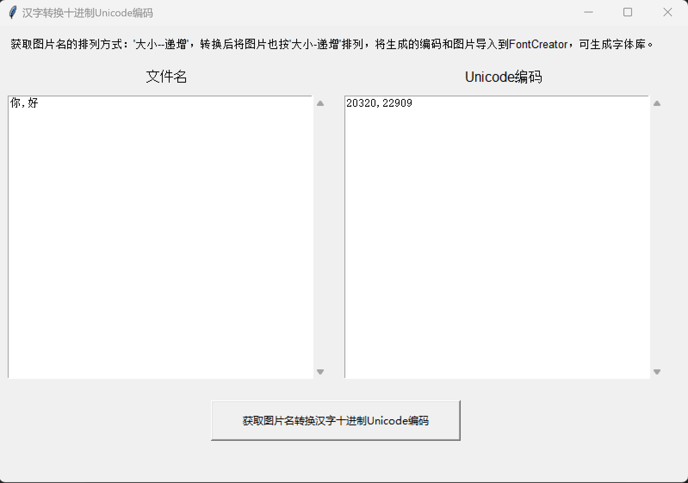

# 汉字转换十进制Unicode编码工具

一个简单的图形界面工具，用于将图片文件名中的汉字转换为十进制Unicode编码，将十进制编码和图片按排列方式导入FontCreator生成计算机字体库。

## 功能特点

- 自动读取指定目录下的图片文件
- 按文件大小排序图片
- 提取图片文件名中的汉字
- 将汉字转换为十进制Unicode编码
- 生成格式化的输出结果

## 使用说明

1. 确保在程序同目录下创建 `pic` 文件夹
2. 将需要处理的图片文件放入 `pic` 文件夹中
3. 图片文件名应为单个汉字（如：`你.jpg`、`我.png`）
4. 运行程序，点击"获取图片名转换汉字十进制Unicode编码"按钮
5. 左侧文本框显示文件名列表，右侧文本框显示对应的Unicode编码

## 安装依赖

```bash
pip install -r requirements.txt
```

## 运行程序

```bash
python 汉字转换十进制Unicode编码.py
```

## 输出格式

程序会生成两个输出：
- 文件名列表：以逗号分隔的汉字列表
- Unicode编码列表：以逗号分隔的十进制Unicode编码列表

## 注意事项

- 确保图片文件名都是单个汉字
- 支持的图片格式：JPG、JPEG、PNG
- 程序会自动按文件大小升序排列图片

## 应用场景

该工具主要用于字体制作，将生成的编码和图片导入到FontCreator等字体编辑软件中，可以生成自定义字体库。
```


# 核心GUI库
tkinter

# 注意：tkinter通常是Python标准库的一部分，不需要额外安装
# 如果您的系统没有tkinter，请使用以下命令安装：
# Ubuntu/Debian: sudo apt-get install python3-tk
# CentOS/RHEL: sudo yum install python3-tk
# Windows: 通常已包含在Python安装中

# 其他标准库依赖（通常不需要单独安装）：
# os
# sys
```


```txt
# 这个工具主要使用Python标准库
# 不需要额外的第三方包

# 如果需要打包为可执行文件，可以添加：
# pyinstaller>=5.0
```

GUI界面：


## 技术支持

- **速光网络软件开发**
- 官网：suguang.cc
- 联系电话/微信：15120086569
- 抖音号：dubaishun12

## 版权信息

Copyright © 2025 速光网络软件开发. All rights reserved.

---
*关注我们的抖音账号获取最新更新和技术支持！*